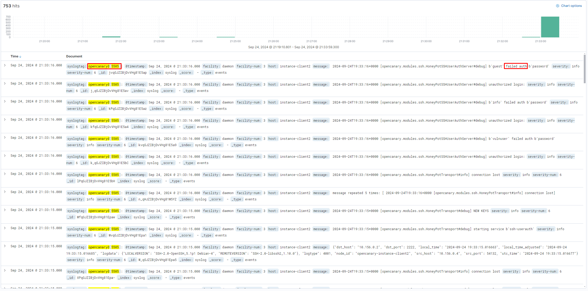
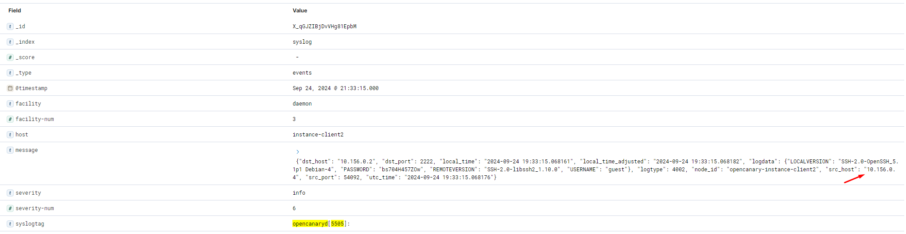
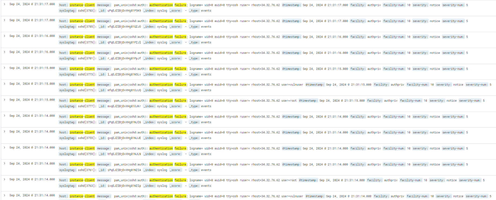
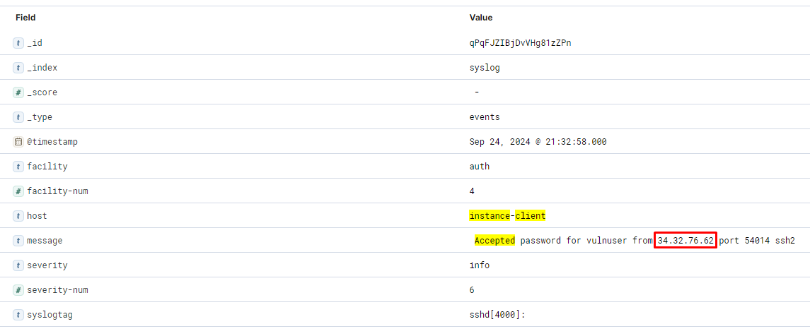

# Task 1

For this task I am deploying the environment to Google Cloud.

## Terraform Overview

Terraform deploys the following:

* 3 virtual machines running Ubuntu 22.04
* Virtual private network for internal traffic inbetween instances
* Firewall on **whitelist** mode to restrict incoming public traffic
* Google Cloud DNS for internal DNS `tiramisu.int`


### VMs deployed
* **instance-siem**
    * Purpose: SIEM, log collector
    * Internal hostname: instance-siem.tiramisu.int
    * Firewall whitelist: SSH (22/tcp) & Kibana (8080/tcp)
* **instance-client**
    * Purpose: log generator
    * Internal hostname: instance-client.tiramisu.int
    * Firewall whitelist: SSH (22/tcp)
* **instance-client2**
    * Purpose: log generator, internal honeypot
    * Internal hostname: instance-client2.tiramisu.int
    * Firewall whitelist: SSH (22/tcp)


## Ansible Overview

Ansible configures the following:

* **instance-siem**
    * Rsyslog Server
        * TLS certs
    * Self-signed CA
    * SIEM
        * Elasticsearch
        * Kibana
    * Nginx reverse proxy for Kibana
* **instance-client**
    * Rsyslog Client
        * TLS certs
* **instance-client2**
    * Rsyslog Client
        * TLS certs
    * Opencanary honeypot (internal network)

All Rsyslog servers use TLS to communicate. Virtual machines **instance-client** and **instance-client2** are configured as clients and forward logs to **instance-siem**.

### Roles

* Role `ca` - Set up self-signed CA and TLS keys for all Rsyslog instances. This is done with separate sub-roles in a way that ensures private keys never leave the servers. Here's how its done:
    * Sub-role `ca` runs on CA instance - Set up self-signed CA
    * Sub-role `rsyslog-tls` runs on rsyslog instances - Distribute CA cert to VMs, generate private keys and certificate signing requests for CA to sign.
    * Sub-role `ca-sign` runs on CA instance - Sign certificate requests 
* Role `rsyslog` - Set up and configure Rsyslog instances
* Role `elastic` - Set up Elasticsearch & Kibana for log query. Configure master Rsyslog server to forward all collected logs to Elastic.
* Role `ansible-role-canary` - Set up opencanary honeypot to be used as an internal network honeypot.
    * This is a publicly available role, I don't take credit for it.

## Demo - generating interesting logs

For this part, I will simulate an attack where a malicious actor gains foothold into the internal network by bruteforcing `instance-client`, where SSH password authentication is disabled and user `vulnuser` has a common password (only for the duration of demo)


### Attacker

Attacker runs the following SSH bruteforce command and finds valid credentials:
```
nmap -p22 --script ssh-brute --script-args userdb=user.lst,passdb=pass.lst 34.107.68.144
```

After gaining foothold, the attacker does reconnaissance and doscvers the internal network. The honeypot is port scanned:
```
ssh vulnuser@$IP << 'EOF'
host="10.156.0.4"
for port in {1..4096}
do
    echo "" > /dev/tcp/$host/$port && echo "Port $port is open"
done 2>/dev/null
exit
EOF
```

The following output is given and multiple services are discovered:

```
Port 21 is open
Port 22 is open
Port 23 is open
Port 80 is open
Port 2222 is open
Port 3389 is open
```

The attacker forwards the remote SSH service running on `2222/tcp` to local machine and runs a bruteforce attack:
```
# Forward 10.156.0.4:2222 to local
ssh -f -N -L 2222:10.156.0.4:2222 vulnuser@34.107.68.144

# Bruteforce port forwarded SSH server
nmap -p2222 --script ssh-brute --script-args userdb=user.lst,passdb=pass.lst localhost
```

Note: The SSH tunnel is just for demo purposes, sophisticated attackers will tunnel the whole network or run less invasive enumeration scripts/tools rather than Nmap.

### Defender

In Elastic, we received a ton of logs from the honeypot indicating an SSH bruteforce:


The random usernames and passwords further confirm that it's a bruteforce attack. Since this server is only visible to the internal network, this could be indicative of lateral movement. Let's investigate a single log further.


After investigating the logs from the instance where the bruteforce attack originated from, it appears that there was an SSH bruteforce attack around the same time as the honeypot was hit:


Following the unsuccessful SSH attempts, there was a successful login indicating a successful SSH bruteforce:


The attacker with ip `34.32.76.62` bruteforced user `vulnuser` and attempted lateral movement.


## Nice to haves

With the task being basic and having a time constraint, some implementations are for Proof of Concept purposes and not meant for production. In production, I would:
* Use a properly secured PKI for certs or letsencrypt with a domain instead of self-signed CA
* Restrict Kibana to internal network and assign domain
* Store Terraform state in the cloud
* Store Terraform deployment output in cloud or elsewhere and source it dynamically from Ansible to increase automation
* Bind internal services to an internal IP as a secondary control instead of relying only on Google Cloud Firewall
