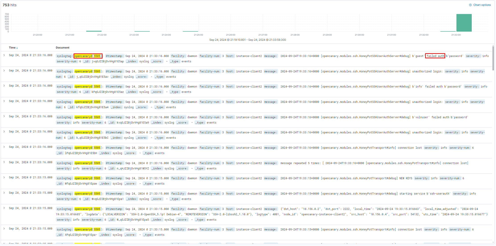

# Task 1

For this task I am deploying the environment to Google Cloud. Three virtual machines, where one is log collector,

## Terraform Overview

Terraform deploys the following:

* 3 virtual machines running Ubuntu 22.04
* Virtual private network for internal traffic
* Firewall on `whitelist` mode to restrict incoming public traffic
* Google Cloud DNS for internal DNS `tiramisu.int`

* instance-siem
    * Purpose: SIEM, log collector
    * Internal hostname: instance-siem.tiramisu.int
    * Firewall whitelist: SSH (22/tcp) & Kibana (8080/tcp)
* instance-client
    * Purpose: log generator
    * Internal hostname: instance-client.tiramisu.int
    * Firewall whitelist: SSH (22/tcp)
* instance-client2 -- log generator, internal honeypot
    * Purpose: log generator, internal honeypot
    * Internal hostname: instance-client2.tiramisu.int
    * Firewall whitelist: SSH (22/tcp)


## Ansible Overview

Ansible configures the following:

* instance-siem
    * Rsyslog Server
        * TLS certs
    * Self-signed CA
    * SIEM
        * Elasticsearch
        * Kibana
    * Nginx reverse proxy for Kibana
* instance-client
    * Rsyslog Client
        * TLS certs
* instance-client2
    * Rsyslog Client
        * TLS certs
    * Opencanary honeypot (internal network)

### Roles

* Role `ca` - Set up self-signed CA and TLS keys for all Rsyslog instances. This is done with separate sub-roles in a way that ensures private keys never leave the servers. Here's how its done:
    * Sub-role `ca`, CA instance - Set up self-signed CA
    * Sub-role `rsyslog-tls`, rsyslog instances - Distribute CA certificate and create certificate signing requests for CA to sign
    * Sub-role `ca-sign`, CA instance - Sign certificate requests 
* Role `rsyslog` - Set up and configure Rsyslog instances
* Role `elastic` - Set up Elasticsearch & Kibana for log query. Configure master Rsyslog server to forward all collected logs to Elastic.
* Role `ansible-role-canary` - Set up opencanary honeypot to be used as an internal network honeypot.
    * This is a publicly available role, I don't take credit for it.

## Demo - generating interesting logs

For this task, I will simulate an attack where a malicious actor gains foothold into the internal network by bruteforcing `instance-client`, where SSH password authentication is disabled and user `vulnuser` i created with a common password (only for the duration of demo)


### Attacker

Attacker runs the following SSH bruteforce command and finds valid credentials:
```
nmap -p22 --script ssh-brute --script-args userdb=user.lst,passdb=pass.lst $IP
```

After gaining foothold, the attacker does reconnoissance and discovers the internal server with a lot of ports open, which is our honeypot, and decides to scan it:
```
ssh vulnuser@$IP << 'EOF'
host="10.156.0.4"
for port in {1..4096}
do
    echo "" > /dev/tcp/$host/$port && echo "Port $port is open"
done 2>/dev/null
exit
EOF
```

The following output is given

```
Port 21 is open
Port 22 is open
Port 23 is open
Port 80 is open
Port 2222 is open
Port 3389 is open
```

Multiple services are discovered, one if which is an additional SSH service running on `2222/tcp` which is forwarded via SSH tunnel and bruteforced:

```
# Forward 10.156.0.4:2222 to local
ssh -f -N -L 2222:10.156.0.4:2222 vulnuser@34.107.68.144

# Bruteforce port forwarded SSH server
nmap -p2222 --script ssh-brute --script-args userdb=user.lst,passdb=pass.lst localhost
```

### Defender

In Elastic, we received a ton of logs from the honeypot indicating an SSH bruteforce




The random usernames and passwords further confirm that it's a bruteforce attack. Since this server is only visible to the internal network, this could be indicative of lateral movement. Lets investigate a single log further.


We can see that the bruteforce is coming internally from 10.156.0.4 (`instance-client.tiramisu.int`). After investigating the logs from that instance, it appears that there was a successful SSH password login after a series of unsuccessful attempts, indicating a successful SSH bruteforce.


The attacker with ip `34.32.76.62` bruteforced user `vulnuser` and attempted lateral movement.
